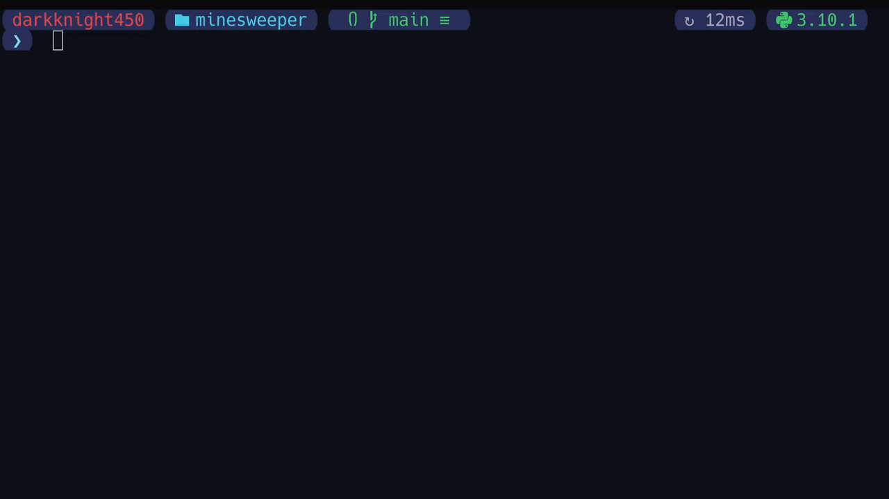

# MINESWEEPER-CLI
The classic Minesweeper, written in **Python3**, designed for the command line.
<p align="center">
	
</p>

**PLAY FULLSCREEN FOR A BETTER EXPERIENCE** <sub>pls 🥺</sub>

## Dependencies
The project only depends on the `curses` library, which should be installed by default on almost all Linux distros.</br>
>Winbl*ws users can go cry inside a hole.</br>
*-Sun Tzu, Art Of War*

## Installation
Simply clone the repository, cd into it and run `minesweeper.py`
```sh
git clone https://github.com/BillyDoesDev/minesweeper.git
cd minesweeper
python minesweeper.py
```

## Usage
```
usage: minesweeper.py [-h] [-v] [-r rows] [-c colums] [-m mines]

CLI Minesweeper written in Python3

options:
  -h, --help     show this help message and exit
  -v, --version  show program's version number and exit
  -r rows        Number of rows in the grid [Defaults to 10]
  -c colums      Number of columns in the grid [Defaults to 10]
  -m mines       Total number of mines [Defaults to 10].
                 If you set an abnormal value, the program 
                 will try to normalise the number of mines on its own.
```

## Note:
The program will throw an error if the window is too small for your entered board size. To fix it, either resize your terminal window, or reduce the board size.
>*Modern problems require modern solutions*</br>
(Yeah, I'm not going for a try catch hell, or doing something that fixes your stupid inputs. Cry about it.)

## Bonus
Want to get a quick minesweeper game for you to play on discord? Say no more-
```python
R,C,M=10,10,10
h,m=0,__import__("random").sample([(r,c)for c in range(C)for r in range(R)],min(R*C-1,M))
b=[['*'if(r,c)in m else''for c in range(C)]for r in range(R)]
for r in range(R):
    for c in range(C):
        if b[r][c]:print("||:boom:||",end="");continue
        if not(k:=sum([len(b[r+r_][c+c_])for c_ in(-1,0,1)for r_ in(-1,0,1)if 0<=r+r_<R and 0<=c+c_<C]))and not h:print("\U0001f7e6",end="");h=1
        else:print(f"||{k}\ufe0f\u20e3||"if k else"||\U0001f7e6||",end="")
    print()
```
What you see up there is a quick (kinda code-golf like) script that generates a minesweeper board.</br>
`R`, `C` and `M` represent the number of **rows**, **columns** and **total mines** respectively.</br>
Simply copy and paste the output and enjoy!

## What next?
If you have suggestions, feel free to [open an issue](https://github.com/BillyDoesDev/Minesweeper/issues) or [create a pr](https://github.com/BillyDoesDev/Minesweeper/pulls).</br>
Feel free to contact me for further discussions at DarkKnight450@protonmail.com</br>

**PS:**</br>
Winbl*ws users can simply do the following to get the dependencies installed...
```sh
py -m pip install windows-curses
```
Lmao
